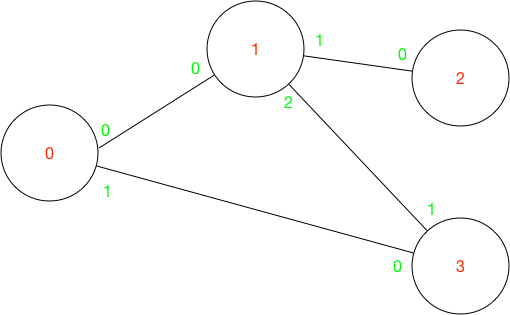

# Distributed Algorithms simulation

## Nodes

The distributed system is modeled by a set of `Node.t`, identified
globally by a `Global_id.t`. Nodes communicate with their neighbors 
using a *local link* identified by a `Local_id.t` 
according to a user-defined topology.



The simulated algorithm is defined in the `Node` and `Message` modules. 
The other modules are used by the *simulator/scheduler*.

```
val create : num_nodes:int -> Global_id.t -> num_neighbors:int ->
  send: (Message.t * Local_id.t -> unit) -> t

val execute : t -> Levent.t -> unit
```

Upon creation, a node is provided with the total number of nodes on the network,
its global identifier, the number of its neighbors, and a `send` function that 
it uses to asynchronously send messages to its neighbors.

A node must also implement a function `execute` which is called by the 
scheduler when a *local event* is delivered.

Local events are of two types. 
* `Meta` events are controling events that are used 
by the simulator to act on the nodes (Currently, only `start` but it could be
extended to model failure or topology change...). 
* `Protocol` messages. Eventually, messages are delivered over a local link 
   which is known to the receiving node. 

```
type t = 
  | Meta of Mevent.t
  | Protocol of Message.t * Local_id.t
```

## Scheduler 

```
type t

val create : adjacency: Global_id.t Array.t Array.t -> t

val start_all_nodes : t -> unit

val schedule : t -> bool
```

The scheduler is initialized with the network topology. It simulates concurrent 
execution of processes over a *reliable* network with *no ordering* guarantees.
To do so, it maintains a priority queue of *global events* (`Gevent.t`), ordered 
by delivery time.  Global events are essentially local events augmented with a 
  delivery time and destination node. The scheduler keeps track of a 
  *simulated time* such that:
 * Messages are delivered at a random time within less than a second after emission,
 * Nodes execute instantaneously.

Example of use:
```
let () =
  let adjacency = [| [|1; 3|]; [|0; 2; 3|]; [|1|]; [|0; 1|] |] in
  let sc = Scheduler.create ~adjacency in
  Scheduler.start_all_nodes sc;
  while Scheduler.schedule sc do () done
```

## Asynchronous Bellman-ford

The current `Node` and `Message` modules define an asynchronous message-passing 
version of the bellman-ford algorithm (see Lynch's Distributed Algorithms p507). 

Each node independently propagates its id through the network. This allows
the receiving nodes to update their routes to the initiating node. The process
eventually converges to a state where each nodes have a routing table telling
them which neighbor to contact to reach any given global id.

# Usage

```
> make
ocamlbuild -use-ocamlfind main.byte
+ ocamlfind ocamlc -c -g -thread -package core,async,ppx_jane -o scheduler.cmo scheduler.ml
Finished, 41 targets (0 cached) in 00:00:03.

> ./main.byte 
Topology:
0 -> 0-1, 1-3
1 -> 0-0, 1-2, 2-3
2 -> 0-1
3 -> 0-0, 1-1
---
3 <- *: Start
3 -> 0: [id = 3 dist = 0]
3 -> 1: [id = 3 dist = 0]
2 <- *: Start
2 -> 1: [id = 2 dist = 0]
1 <- *: Start
1 -> 0: [id = 1 dist = 0]
1 -> 2: [id = 1 dist = 0]
1 -> 3: [id = 1 dist = 0]
0 <- *: Start
0 -> 1: [id = 0 dist = 0]
0 -> 3: [id = 0 dist = 0]
2 <- 1: [id = 1 dist = 0]
2: routes [0: dist 4611686018427387903, route *; 1: dist 1, route 0; 2: dist 0, route *; 3: dist 4611686018427387903, route *]
3 <- 0: [id = 0 dist = 0]
...

> ./main.byte | grep routes
2: routes [0: dist 4611686018427387903, route *; 1: dist 1, route 0; 2: dist 0, route *; 3: dist 4611686018427387903, route *]
3: routes [0: dist 1, route 0; 1: dist 4611686018427387903, route *; 2: dist 4611686018427387903, route *; 3: dist 0, route *]
1: routes [0: dist 2, route 2; 1: dist 0, route *; 2: dist 4611686018427387903, route *; 3: dist 4611686018427387903, route *]
3: routes [0: dist 1, route 0; 1: dist 1, route 1; 2: dist 4611686018427387903, route *; 3: dist 0, route *]
2: routes [0: dist 3, route 0; 1: dist 1, route 0; 2: dist 0, route *; 3: dist 4611686018427387903, route *]
1: routes [0: dist 1, route 0; 1: dist 0, route *; 2: dist 4611686018427387903, route *; 3: dist 4611686018427387903, route *]
0: routes [0: dist 0, route *; 1: dist 4611686018427387903, route *; 2: dist 4611686018427387903, route *; 3: dist 1, route 1]
0: routes [0: dist 0, route *; 1: dist 1, route 0; 2: dist 4611686018427387903, route *; 3: dist 1, route 1]
1: routes [0: dist 1, route 0; 1: dist 0, route *; 2: dist 1, route 1; 3: dist 4611686018427387903, route *]
1: routes [0: dist 1, route 0; 1: dist 0, route *; 2: dist 1, route 1; 3: dist 1, route 2]
3: routes [0: dist 1, route 0; 1: dist 1, route 1; 2: dist 2, route 1; 3: dist 0, route *]
0: routes [0: dist 0, route *; 1: dist 1, route 0; 2: dist 2, route 0; 3: dist 1, route 1]
2: routes [0: dist 2, route 0; 1: dist 1, route 0; 2: dist 0, route *; 3: dist 4611686018427387903, route *]
2: routes [0: dist 2, route 0; 1: dist 1, route 0; 2: dist 0, route *; 3: dist 2, route 0]
```

When this is run in terminal, global ids should appear in red, and local ids in green.